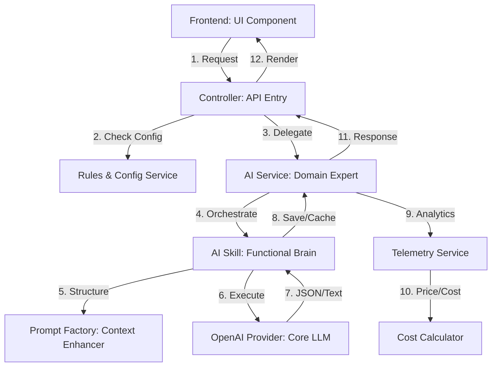

# Deep Dive: AI Architecture & Implementation

This document provides a comprehensive technical breakdown of how Artificial Intelligence is integrated into the Ribo ecosystem. It covers the data flow, component hierarchy, the specialized "Skill" system, and the **actual prompts** used to instruct the AI.

## 1. High-Level Architecture Flow

The system follows a "Layered Intelligence" approach, ensuring that logic is separated from raw AI instructions.



---

## 2. The Core Prompts (The "Instructions")

The following are the actual **System Prompts** that define how the AI behaves. You can modify these to enhance the AI's "intelligence" or tone.

### 2.1 Triage Prompt (`TriagePromptFactory.php`)
This prompt is used to analyze new incoming emails to determine their "Sales" value and "Urgency".

**System Prompt (current summary):**
> "SDR Manager expert prompt with strict triage policy, urgency rules, module-aligned recommendation format, and instruction-injection guardrails. It returns JSON with required keys: summary, intent, intent_confidence, priority, success_probability, behavioral_pulse, strategic_action."

**User Context (Reference):**
The AI is fed the `Subject`, `Snippet`, `Participants`, and `Recent Messages`. It is restricted to these enums:
- **Intent**: `sales`, `support`, `billing`, `partnership`, `spam`, `general`, `follow_up`
- **Priority**: `low`, `medium`, `high`, `urgent`
- **Pulse**: `heating_up`, `cooling_down`, `stable`

### 2.2 Magic Draft Prompt (`DraftPromptFactory.php`)
This prompt is used when a user clicks "Magic Draft" to generate a reply.

**System Prompt:**
> "You write clear and context-aware email drafts for conversation follow-ups. Return valid JSON only with keys: subject, body."

**User Context (Reference):**
The AI receives the `Tone` (Professional, Friendly, Concise) and the user's specific `Instruction`.

### 2.3 Memory Prompt (`MemoryPromptFactory.php`)
This prompt is used to summarize a long-term relationship with a contact.

**System Prompt:**
> "You summarize customer relationship memory. Return JSON only with keys: relationship_summary, relationship_strength, memory_points."

**User Context (Reference):**
The AI is fed a list of all recent linked threads to detect patterns in the customer's behavior over time.

---

## 3. Actual Implementation Code

### 3.1 The Provider (`OpenAiConversationClient.php`)
This is the low-level client that communicates with OpenAI.

```php
// app/Services/AI/Providers/OpenAiConversationClient.php

public function generateDraft(array $context): array {
    // 1. Sends the System + User Prompts to OpenAI
    // 2. Expects JSON back
    // 3. Reports token usage for billing/telemetry
}

public function analyzeThread(array $context): array {
    // Concept: Returns the structured triage data (Intent, Priority, etc.)
}
```

### 3.2 The Telemetry Layer (Cost Tracking)
This code ensures that every AI call is tracked for the Admin Dashboard.

```php
// app/Services/AI/ConversationAiTelemetryService.php

public function recordSuccess($companyId, $feature, $threadId, $model, $tokens): void {
    $estimatedCost = $this->costCalculator->calculate(
        $model, 
        $tokens['prompt_tokens'] ?? 0, 
        $tokens['completion_tokens'] ?? 0
    );

    AiUsageLog::create([
        'created_by' => $companyId,
        'feature' => $feature,
        'model_version' => $model,
        'prompt_tokens' => $tokens['prompt_tokens'] ?? 0,
        'completion_tokens' => $tokens['completion_tokens'] ?? 0,
        'estimated_cost' => $estimatedCost,
        'requested_at' => now(),
    ]);
}
```

### 3.3 The Price List (`AiUsageCostCalculator.php`)
We map model names to their actual market prices here.

```php
// app/Services/AI/AiUsageCostCalculator.php

private const PRICING = [
    'gpt-4o' => ['prompt' => 0.005, 'completion' => 0.015], // Per 1k tokens
    'gpt-4o-mini' => ['prompt' => 0.00015, 'completion' => 0.0006],
    'claude-3.5-sonnet' => ['prompt' => 0.003, 'completion' => 0.015],
];
```

---

## 4. How to Enhance the AI
To improve the AI's performance, you should primarily modify the **Prompt Factories** (`app/Services/AI/Prompts/`).

1.  **To improve accuracy**: Update the `buildSystemPrompt` to provide more examples of what you consider "High Priority."
2.  **To add context**: Update the `buildUserPrompt` to include more data from the database (e.g., adding the lead's "Total Spent" or "Company Size").
3.  **To change tone**: Update the "Magic Draft" instructions to match your brand's voice.

> [!TIP]
> **Pro Tip**: When updating prompts, always keep the AI's response format (JSON) in mind. If you change the requested keys in the prompt, you must also update the corresponding `Skill` class to handle the new keys.
