# Omnichannel Webhook & OAuth Routing Flow

This document outlines the architecture for securely connecting multi-tenant social media accounts (Facebook/WhatsApp) using OAuth 2.0, and how the CRM routes incoming webhook events to the correct company dashboard based on cryptographically verified Meta Page IDs.

## System Flowchart

```mermaid
sequenceDiagram
    autonumber
    
    actor User as Company Owner
    participant Frontend as RIBO CRM Settings (UI)
    participant Backend as RIBO CRM Server
    participant Meta as Facebook / Meta API
    participant DB as RIBO Database
    
    rect rgb(30, 40, 60)
    Note over User, DB: 1. The OAuth Connection Flow (Proving Ownership)
    User->>Frontend: Clicks "Connect to Facebook"
    Frontend->>Backend: Hits route `/auth/facebook/redirect`
    Backend->>Meta: Requests secure OAuth Login Page
    Meta-->>User: Prompts: "RIBO CRM wants to access your Pages"
    User->>Meta: Logs in & Approves Access
    Meta->>Backend: Redirects to `/auth/facebook/callback` with temporary code
    Backend->>Meta: Exchanges code for secure `access_token`
    Meta-->>Backend: Returns `access_token`
    Backend->>Meta: "Which Pages does this token own?" (Graph API)
    Meta-->>Backend: Returns `[ { "name": "Company A Facebook", "id": "123456" } ]`
    Backend->>DB: Saves `facebook_page_id = 123456` and `access_token` to Company's Account
    Backend-->>Frontend: Redirects back to settings with "Connected" status.
    end

    rect rgb(40, 50, 30)
    Note over User, DB: 2. The Webhook Routing Flow (Processing Leads)
    actor Customer as Facebook User
    Customer->>Meta: Sends a message to "Company A Facebook"
    Meta->>Backend: Sends Webhook event to `/webhooks/facebook`<br/> Payload: `{"recipient": {"id": "123456"}, "message": "Hello!"}`
    
    Backend->>Backend: Extracts `recipient.id` ("123456")
    Backend->>DB: Queries: `SELECT company_id FROM social_accounts WHERE facebook_page_id = 123456`
    DB-->>Backend: Returns: Company A (ID: 15)
    
    Backend->>Backend: Instantiates `LeadEventTrackerService` for Company ID 15
    Backend->>DB: Saves Lead Event & Timeline Activity tied to Company 15
    end
```

## Core Validation Mechanics
1. **Security (Steps 7 & 8):** The system asks Facebook directly what pages the user owns using the encrypted access token. A malicious user cannot spoof this to steal someone else's incoming leads.
2. **Reliable Matching (Step 13):** Whenever Facebook sends a webhook, they *always* include the `recipient.id` (the Page ID receiving the message). Because the system securely stored that exact ID during the verified logging process (Step 10), it definitively guarantees that the webhook belongs to that specific company.
